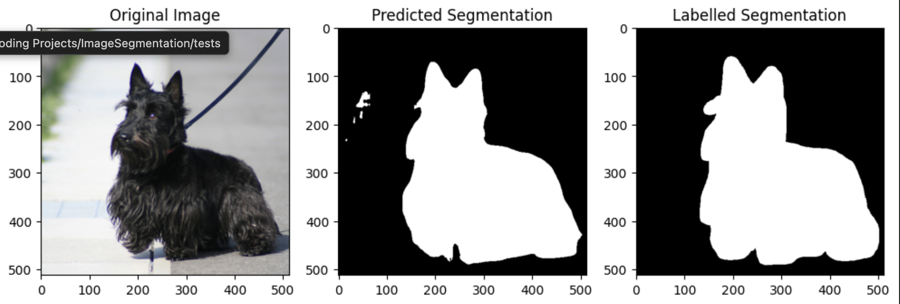

# Image Segmenation 
Straightforward implementation of UNET Architecture from "U-Net: Convolutional Networks for BiomedicalImage Segmentation" by Ronneberger et al. applied to the Oxford-iiit-pet dataset.

There are three primary folders:
    - data_utils
    - sweep
    - models

data_utils contains functions related to data processing / organising to create the ImageSegmentationDataset class

sweep contains a config file and script to execute a WandB sweep script for experiment purposes.

models contains relevant torch.nn model classes to build the UNet architecture. Model blocks contains submodules of UNet (Encoder, Middle block and Decoder) and UNet contains the final model.

Folders that are empty are just the folder used to contain the downloaded data, train,test,validation split paths and any other data has been generated.

Final inference visualisation for one of the trained models is shown in the model_inference_visualisation notebook.

To get started you will need to:
- Download the Oxford-iiit-pet dataset (or any other segmentation dataset with binary masks)
- Download the project requirements using `uv sync` (if using uv package manager)

To run the sweep you will need to log in to WandB first and then you can run: 
`python -m sweep.model_sweep`
